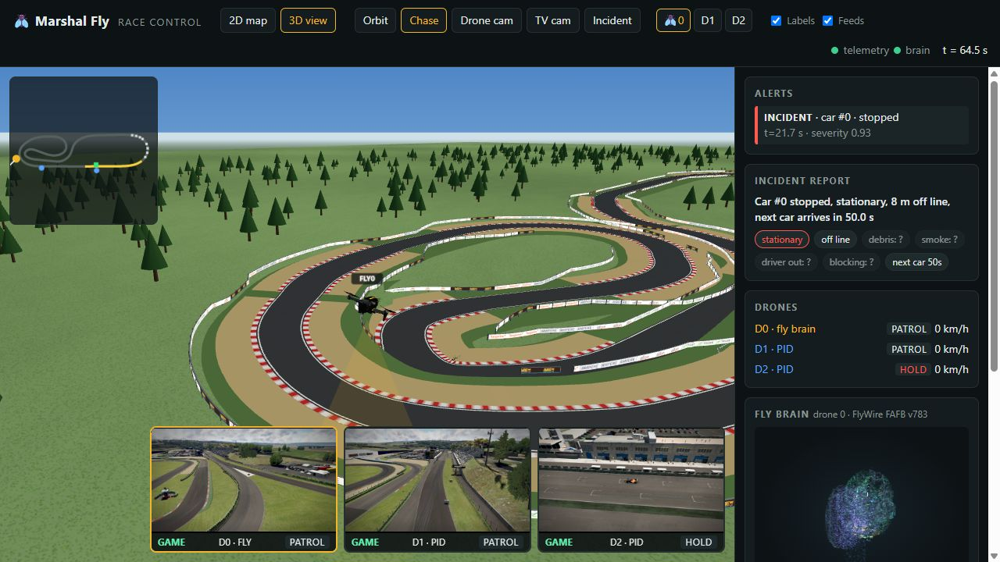
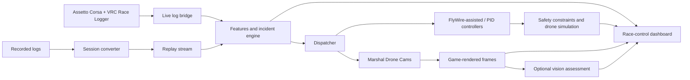

# Fly Marshal

**FormulaTech Hacks · Track 1: Safety Diagnosis · Final project submission**

Fly Marshal turns race telemetry into incident alerts, dispatches simulated safety drones, and brings camera views and incident summaries into one race-control dashboard. Assetto Corsa provides the race environment. A real FlyWire connectome simulation contributes steering to one drone alongside conventional navigation and safety controls.

The project explores mobile visual coverage for circuits with limited fixed cameras. GPS can locate a car; a camera can help officials understand what is happening around it. This submission demonstrates that workflow in simulation. It does not establish faster rescue times or replace marshals, medical teams or official race control.



## Demo workflow

1. **Observe:** read each car's position, speed, lap, pit status, model and skin from VRC Race Logger.
2. **Detect:** use trained incident/risk models and a separate online speed reference to identify hazards and sustained slow running.
3. **Dispatch:** assign at most one drone to each car, move toward the incident, and escort slow cars as they move.
4. **Assess:** show the 2D map, interactive 3D environment, game camera feeds and incident cards together.
5. **Communicate:** display buffered yellow zones, with optional in-game native flags and experimental AI slowing.

Warnings are reassessed and cleared after recovery. Changing sessions resets old alerts, drones, reports and camera data automatically. The player is green on the map and has a red downward marker in 3D. Locally converted Tatuus cars use their recorded liveries; the environment includes an FPV drone model and FormulaTech sponsor barriers.

## Architecture



Live and replay share the same telemetry interface. The stream uses WebSocket **8765**, the brain publishes on **8766**, and the dashboard runs at **http://localhost:8000**. Lua camera/caution commands use short-lived JSON files in AC's `logs` folder. Live data is buffered by the logger and bridge, not instantaneous game-state access.

## Run the project

### Requirements

- Python, a virtual environment and [requirements.txt](requirements.txt). The development machine uses Python 3.14; use a version supported by the pinned dependencies.
- Git with submodules. The browser needs internet access for Three.js CDN modules.
- PyTorch, installed separately for your CPU/CUDA environment. CUDA is recommended for the real connectome.
- Live mode: Assetto Corsa, Custom Shaders Patch with Lua apps (developed against CSP 0.2.11), and VRC Race Logger.
- Optional: Blender 4.2 for local FBX conversion and an API key for vision.

### First-time setup — Windows Command Prompt

```bat
git clone --recurse-submodules https://github.com/Harkit2004/fly-marshal.git
cd fly-marshal
python -m venv .venv
.venv\Scripts\python.exe -m pip install -r requirements.txt
```

Install PyTorch using the command for your machine from the [official installer](https://pytorch.org/get-started/locally/). For an existing clone, run `git submodule update --init --recursive`.

Copy `.env.example` to `.env` if it does not exist. For live racing, configure your installation path:

```dotenv
AC_ROOT=B:/SteamLibrary/steamapps/common/assettocorsa
```

API keys belong in `.env`, which Git ignores. General settings are in [settings.toml](settings.toml).

### Replay demo — no game or API key required

```bat
.venv\Scripts\python.exe tools\make_synthetic.py
.venv\Scripts\python.exe tools\run_demo.py
```

Open **http://localhost:8000**. The synthetic race contains scripted incidents and is demonstration data. Camera tiles use the 3D fallback. Without downloaded FlyWire connectivity, drone 0 uses a placeholder controller and the neural viewer does not invent activity.

### Live demo

1. Copy `third_party/assetto-corsa-race-logger/app/vrc_race_logger` into `<AC>/apps/lua/` and enable **VRC Race Logger**. For responsive logging, set `FLUSH_SECONDS = 1` in the installed logger; upstream versions may flush less frequently.
2. Install the camera/flag app:

   ```bat
   .venv\Scripts\python.exe tools\install_game_cams.py
   ```

3. Restart the AC session, open **Marshal Drone Cams** from the Lua sidebar, and start a race with the logger enabled.
4. Launch:

   ```bat
   .venv\Scripts\python.exe tools\run_demo.py --live --game-feeds
   ```

5. Open **http://localhost:8000**. Press **Ctrl+C** in the terminal to stop the components.

The launcher starts the stream, brain and dashboard together. **The fly brain starts automatically** and waits for race telemetry. Logs are in `data/runtime/stream.log`, `brain.log` and `dashboard.log`. If ports are occupied, stop the previous launcher rather than starting a duplicate.

Track geometry comes from the current track's AI line, or first-lap coverage when no AI line exists. Session changes are detected through the logger's active-recording pointer. The configured bridge delay is two seconds, in addition to logger buffering; this is not a measured end-to-end latency guarantee.

### Real FlyWire controller

```bat
.venv\Scripts\python.exe tools\fetch_flywire.py
.venv\Scripts\python.exe tools\fetch_flywire.py --synapses
```

The synapse download is approximately 2.7 GB, with additional space and memory needed for processing. Configure `[flybrain]` or `FLYBRAIN_*` environment variables. The verified local stride-8 configuration loads **139,255 neurons and 5,773,733 connections** on CUDA.

The corrected leaky integrate-and-fire implementation uses a 20 ms membrane time constant. Heading responds to left/right photoreceptor activity; forward speed and altitude use conventional assistance. **This is connectome-assisted steering, not an end-to-end biological flight policy.** The viewer displays a spatial subset of real neurons and their simulated spikes. Larger connectivity settings require more resources.

### Cars, skins and local assets

The public clone falls back to procedural cars if the Tatuus GLB is absent. AC car geometry and converted skin textures are local assets and are not committed. See [model setup](dashboard/assets/models/README.md) for the Blender conversion command.

When configured, the launcher incrementally prepares installed Tatuus liveries. Each car receives its recorded `skin` ID; newly converted replay CSVs retain it too. Missing skins and older recordings use the base texture. Different car models are not given Tatuus skins merely because skin names match. Custom CSP paint effects are not reproduced.

## Detection and response

### Trained incident models

The incident detector and five-second risk predictor use LightGBM/logistic-regression blends with features normalized against track context. Artifacts are included in `models/`; raw training sessions are not.

Historical evaluation trained on six Vallelunga sessions and measured transfer on Spa GT3 and F1 sessions:

| Historical Spa evaluation | Rules | Trained models |
|---|---:|---:|
| Incidents detected | 11 / 47 | 21 / 47 |
| False alarms per minute | 0.51 | 0.83 |

Sources: [evaluation summary](reports/e2e/summary.json), [per-session reports](reports/e2e/) and [training report](reports/training/report.json). These results are **not a fresh benchmark of the final combined system**. Spa data informed an earlier diagnostic fix, so it is not a completely untouched test set. Minor slides, some stopped-car cases and advance prediction remain weak points.

### Online slowdown reference

The independent `[live_speed]` component learns normal speed per car model and approximately 50 m section. Each car/lap/section contributes one median speed. The reference uses up to 40 accepted passes and requires five before detection begins.

- Excludes each car's first observed lap and a 45-second startup grace period, including when joining mid-race.
- Excludes pits, alerts, off-track/spinning cars, model anomalies and yellow-controlled traffic from learning.
- Rejects passes below 80% of an established reference, protecting it against repeated blocked laps.
- Flags moving cars below 65% of expected speed AND at least 30 km/h slower for two seconds, without requiring a previous crash.
- Can flag multiple cars in a blockage while assigning at most one drone per car.

The reference resets with a new session, track or restart. Initial learning still needs clean data; congestion before a reliable reference exists cannot always be distinguished from normal pace. Recovery uses the current section's reference; entering an unlearned section releases the escort after the clearing delay. This component does not retrain or replace the crash models.

### Yellow zones and AI control

Active incidents create zones **200 m before and 50 m after** the car. Overlaps merge and wrap at the start line. The map and 3D ribbons follow active incidents and clear with them.

**Marshal Drone Cams** provides a display-only flag, optional native yellow override, and experimental local AI slowing. The native override replaces AC's current flag while the player is in a fresh yellow zone, including other flag types, then releases control on exit or expiry.

AI slowing uses an **80 km/h** cap, **250 m** braking approach, reduced aggression and following-distance control. Player, pit and incident cars are excluded. These controls need CSP physics access, exclude online/replay sessions, and do **not** guarantee no overtaking or enforce penalties. On release, saved aggression is restored and our speed cap is removed; another script's previous speed cap cannot be recovered.

## Cameras and optional vision

The dashboard offers Orbit, Chase, Drone, TV and Incident cameras, feed tiles and a minimap. Fresh game captures say **GAME**; stale/unavailable captures use **3D**. Targets are 640×360 at four captures/sec during incidents and two during patrol, subject to GPU/game performance.

GeometryShot can omit distant cars or particles. The Lua app's optional main-camera takeover captures the actual game view for spectating. Detailed acceptance work is recorded in [ISSUE_1_CHECKLIST.md](ISSUE_1_CHECKLIST.md).

Vision is disabled in the committed settings. To enable it, configure `[vision]`, add `OPENAI_API_KEY` to `.env`, and restart. The implemented provider is OpenAI. Only fresh, event-matched **game images** are assessed; Three.js fallback images are not evidence. Calls are asynchronous and timeout-bounded. Failure retains the telemetry report. Uncertain debris, smoke, driver-out and blocking fields remain `?`; injuries are not inferred. Provider charges may apply.

## Verification and limitations

```bat
.venv\Scripts\python.exe -m unittest discover -s tests -v
node tests/test_caution_zones.mjs
```

Tests cover session handling, image provenance, report parsing, stale data, incident lifecycle, speed learning, skin mapping and mocked CSP controls. Browser checks verified player markers, yellow ribbons, separate Tatuus liveries and sponsor barriers. Real FlyWire loading and neural activity were verified locally on CUDA.

Remaining live acceptance: matched camera on/off FPS comparison, broader distant-car visibility checks, native flag/AI behaviour, the final online slowdown detector during a race, and a live vision result appearing on an incident card. A standalone real vision request succeeded, but that does not establish the entire live workflow. Replay fallback was checked visually; testing with AC fully closed remains pending.

Drones are simulated. The configured 130 m/s maximum speed is a demo parameter, not a physical drone specification. No operational safety certification, rescue-time improvement or real-world autonomous flight claim is made.

## Configuration and rollback

Change [settings.toml](settings.toml), restart the launcher and refresh the dashboard.

| Setting | Purpose / rollback |
|---|---|
| `live_speed.enabled` | Disable to restore the previous fixed-reference slow-car rule |
| `scene.yellow_zones_enabled` | Disable caution zones |
| `scene.yellow_3d_enabled` | Disable yellow roadside ribbons |
| `scene.yellow_hud_enabled` | Disable display-only flags |
| `scene.yellow_native_enabled` | Disable the native flag override |
| `scene.yellow_ai_enabled` | Disable experimental AI slowing |
| `models.car.file` | Empty string restores procedural cars |
| `models.car.skin_manifest` | Remove to use one base livery |
| `game_feeds.enabled` | Disable capture requests; omit `--game-feeds` too |
| `vision.enabled` | Disable remote image assessment |

The Lua app also offers immediate disable switches for native flags, AI control and camera takeover. Local model/skin preparation does not modify installed AC assets.

## Repository guide

| Path | Role |
|---|---|
| `brain.py` | Detection, lifecycle, dispatch and message orchestration |
| `pipeline/` | Log conversion, live/replay streaming and track reconstruction |
| `ml/` | Features, detectors, training and online speed reference |
| `drones/` | Controllers, flight simulation, safety constraints and camera transport |
| `ac_apps/marshal_drone_cams/` | CSP cameras, HUD, native flags and AI controls |
| `dashboard/` | 2D/3D views, neural viewer, skin mapping and sponsor assets |
| `cv/` | Telemetry summaries and asynchronous vision assessment |
| `tools/` | Launcher, installers, synthetic data and local asset preparation |
| `tests/`, `reports/` | Regression checks, evaluation and visual evidence |

Converted sessions contain `telemetry.csv`, `events.csv`, `centerline.csv` and `meta.json`. Convert recordings with `python -m pipeline.vrclog_adapter <log-path> --name <session-name>`, then use `tools/run_demo.py --session data/sessions/<session-name>`. Coordinates are metres, AC Y-up; track position is normalized from 0 to 1.

## Attribution

- [assetto-corsa-race-logger](https://github.com/Zhaoyi-Fan/assetto-corsa-race-logger) — MIT; logging, parsing and analyzer-derived labels. Git submodule.
- [flybrain](https://github.com/dylankainth/flybrain) — MIT; upstream connectome controller adapted here. Git submodule.
- FlyWire public v783 data and the navis-flybrains brain mesh — fetched separately; mesh licensing is documented upstream.
- Assetto Corsa and CSP — local simulation/rendering environment. Game geometry and converted liveries remain local.
- Three.js — browser rendering. See [model notes](dashboard/assets/models/README.md) and [sponsor artwork notes](dashboard/assets/sponsors/README.md) for asset provenance.

FormulaTech sponsor artwork is event branding, not an endorsement of the prototype's safety claims.
